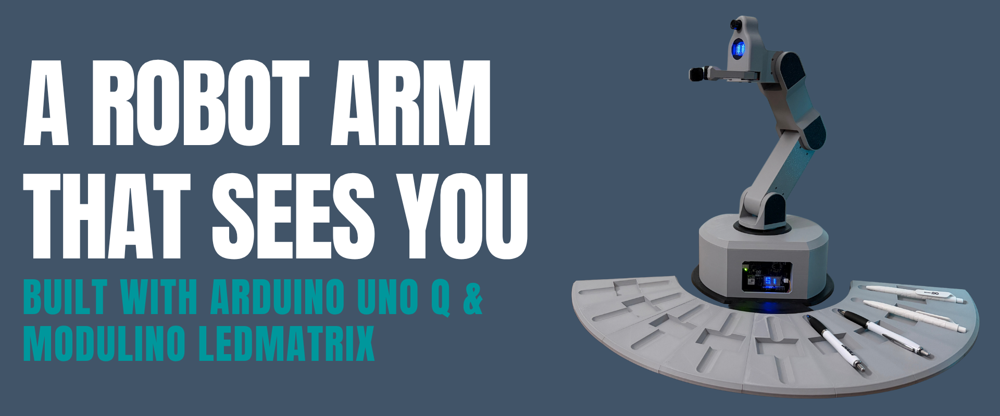

# A Robot Arm That Sees You — Built with Arduino UNO Q & Modulino LedMatrix

A robot arm that recognizes people and delivers gadgets to them — no buttons, no commands, just interaction. Built with the new Arduino UNO Q 4GB and the new Modulino LedMatrix, which gives the robot its friendly face. The arm runs on Feetech digital servo motors with a Waveshare control board, and a camera on the head handles the recognition. From high school tinkering to projects like this — this is what Arduino made possible for me.

---

## Assembly Tutorial

<div align="center">
  <a href="https://www.youtube.com/watch?v=VIDEO_ID" target="_blank">
    
  </a>
</div>

---

## Required Hardware

| Component | Details |
|---|---|
| **Arduino UNO Q** | Main board (MPU + MCU, onboard LED matrix 8×13) |
| **4× servo STS3215** | Half-duplex serial bus, IDs 1–4 |
| **Standard PWM servo** | Gripper on digital pin **D9** |
| **2× pressure sensor** | Analog on **A0** and **A1** |
| **Modulino LED Matrix** | Head display 12×8 (optional but recommended) |
| **Half-duplex adapter** | To connect STS3215 to UNO Q Serial port |

### Pin Scheme

```
D9         → gripper servo signal (PWM)
A0         → pressure sensor 1
A1         → pressure sensor 2
Serial (pins 0 & 1) → STS3215 bus (1 Mbit/s, half-duplex)
Modulino Quick Connector → Modulino LED Matrix (head, I2C)
```

---

## Electrical Schematic


The schematic above shows the complete electrical connections for the robot, including:
- **Arduino UNO Q** as the main control board
- **STS3215 servo motors** (4×) connected via the Waveshare driver board on the half-duplex serial bus at 1 Mbit/s
- **PWM servo** for gripper control on digital pin D9
- **Pressure sensors** (2×) on analog inputs A0 and A1
- **Power distribution** from a 12V 10A power supply
- **Modulino LED Matrix** connected via I2C on the Quick Connector for the head display

---

## Bill of Materials (Non-Printed Components)

| Component | Qty | Link |
|---|---|---|
| Arduino UNO Q 4GB RAM | 1 | [Buy on Arduino Store](https://store.arduino.cc/products/uno-q-4gb?variant=56485750473079) |
| Modulino LED Matrix | 1 | [Buy on Arduino Store USA](https://store-usa.arduino.cc/products/modulino-led-matrix?srsltid=AfmBOor0GNZJKd0D2jL9f3H0CvfEBB8TRz-Tk1juMp406W2SSdXQ8VzM) |
| Feetech Digital STS3215 Servo Motors | 4 | [Buy on AliExpress](https://it.aliexpress.com/item/1005009271910382.html?spm=a2g0o.order_list.order_list_main.122.6c1d3696TBFRL9&gatewayAdapt=glo2ita) |
| Waveshare Serial Bus Servo Driver Board | 1 | [Buy on Amazon](https://www.amazon.it/dp/B0CJ6TP3TP?ref=ppx_yo2ov_dt_b_fed_asin_title) |
| Ball Bearing | 1 | [Buy on AliExpress](https://it.aliexpress.com/item/1005009736872307.html?spm=a2g0o.order_list.order_list_main.74.6c1d3696TBFRL9&gatewayAdapt=glo2ita) |
| Pressure Sensors | 2 | [Buy on AliExpress](https://it.aliexpress.com/item/1005009958997279.html?spm=a2g0o.order_list.order_list_main.36.6c1d3696TBFRL9&gatewayAdapt=glo2ita) |
| 12V 10A Power Supply | 1 | [Buy on Amazon](https://www.amazon.it/-/en/dp/B0D1VHNF9R?ref_=ppx_hzsearch_conn_dt_b_fed_asin_title_1) |
| DC Converter 12V to 5V 3A | 1 | [Buy on Amazon](https://www.amazon.it/dp/B08MWK3VKC?ref=ppx_yo2ov_dt_b_fed_asin_title) |
| Lemorele USB-C Docking Station | 1 | [Buy on Amazon](https://www.amazon.it/dp/B08GM2H1Q2?ref=ppx_yo2ov_dt_b_fed_asin_title&th=1) |
| Micro Servo Metal Gear 90° | 1 | [Buy on Amazon](https://www.amazon.it/dp/B0C38H8TBY?ref=ppx_yo2ov_dt_b_fed_asin_title&th=1) |
| USB Camera | 1 | [Buy on Amazon](https://www.amazon.it/dp/B0DNT67G7C?ref=ppx_yo2ov_dt_b_fed_asin_title) |
| Resistors Kit | 1 | Common electronics store |
| M3 Screws | Various | Common hardware store |
| Power Supply Wires | As needed | Common hardware store |
| Power Cable 18/16 AWG | 1 roll | Common hardware store |
| Circular Power Connector | 1 | Common electronics store |
| Circular Switch 2-Pin | 1 | Common electronics store |
| Threaded Inserts (3×4, 5×5 mm) | Set | [Buy on AliExpress](https://it.aliexpress.com/w/wholesale-threaded-inserts-m3.html) |

---

## 3D Files and Printing

3D files are available in the **`3d_models/`** folder:

- **`models.3mf`** – Complete project with all components **already oriented and ready to print** (recommended)
- **Individual STL files** – For those who prefer manual slicing

### Recommended Materials

| Component | Material | Notes |
|---|---|---|
| Arm structure, base, covers | **PETG HF** | Resistant, good rigidity, high temperatures |
| Gripper components (gripper_*) | **TPU 95A** | Elastic, shock-absorbing, suitable for repeated movements |

---

## Arduino Libraries to Install

Open **Tools → Manage Libraries** in Arduino IDE / Arduino Lab and install:

| Library | Min version | Notes |
|---|---|---|
| `Arduino_RouterBridge` | latest | Bridge MCU↔MPU |
| `SCServo` | latest | STS3215 control |
| `Arduino_LED_Matrix` | latest | Onboard UNO Q matrix |
| `ArduinoGraphics` | latest | LED Matrix dependency |
| `Modulino` or `Arduino_Modulino` | latest | For LED head (optional) |

---

## Python Dependencies

The project runs on the MPU (Linux) side of UNO Q via Arduino Python environment. No manual installation required: the dependencies (`arduino.app_utils`, `arduino.app_bricks.video_objectdetection`) are part of the Arduino SDK.

Only standard libraries are used: `datetime`, `time`, `threading`, `math`, `os`, `sys`, `functools`.

---

## How to Upload and Run

1. Open **Arduino Lab** (or Arduino IDE with UNO Q support).
2. Upload the sketch `sketch/sketch.ino` to the board.
3. The Python app `python/main.py` is automatically started by the Arduino environment on the MPU side.
4. Real-time logs are also written to `python/robot.log` (with timestamp).

---

## Robot Setup (First Power-On or Reset)

On startup, the robot automatically enters **setup mode**. The onboard matrix shows the current step (**S1**, **S2**, **S3**).

STS3215 servo torque is **disabled**: you can move the arm freely by hand.

### Step S1 – HOME Position

1. Move the arm by hand to the HOME position (upright, centered).
2. Hold it steady for **5 seconds** → the matrix blinks the step number during the countdown.
3. Once captured, the robot nods with servo 4 to confirm, then moves to S2.

### Step S2 – Slot Positions (up to 9)

1. Move the arm toward the **first slot** (where the pens are).
2. Hold it steady for **5 seconds** → slot captured, the robot returns to HOME and nods.
3. Repeat for each following slot (up to a maximum of **9 slots**).
4. After the last slot, the robot returns to HOME and shows **S3** → setup complete.

> The system ignores small vibrations and microadjustments: it waits for real manual movement before starting the countdown.

### Step S3 – Setup Complete

The robot enters **detect** state and is operational.

---

## Normal Operation

```
setup → detect → grab → delivery → (face detected) → release → detect → ...
```

| State | What it does | Display |
|---|---|---|
| **detect** | Awaits face detection; idle animation on servos | Blinking eyes, matrix **D** |
| **grab** | Collects pen from current slot (base rotation → descent → gripper close → HOME) | Fixed eyes, matrix **G** |
| **delivery_waiting** | Waits at HOME with pen in hand for a face to arrive | Fixed eyes |
| **release** | Detects face → shows hearts, opens gripper, delivers pen | Heart eyes, matrix **R** |

### Grab Cycle Details

1. Base rotation toward slot
2. Partial descent (50% travel)
3. Gripper soft open (~165°)
4. Full descent to slot
5. Gripper close (180° × 3 attempts)
6. Return to HOME
7. Wait for face for delivery

Pressure sensors on A0/A1 are read before and after gripper close (log: `[GRAB][PRESSURE]`).

### Idle Animation

When in **detect** state, the arm performs smooth sinusoidal oscillation on all 4 servos (period 10 s), then returns to HOME and stops for 30 s before repeating.

---

## Error Codes (Onboard Display)

| Display | Code | Cause |
|---|---|---|
| `ER1` | Setup pose unavailable | One or more STS3215 don't respond to ping during setup |
| `ER2` | Grab slot not configured | Grab requested but no slot configured |
| `ER3` | STS move failed | STS movement command failed |
| `ER4` | *(deprecated)* | Matrix unavailable |
| `ER5` | Pressure read failed | Pressure sensor read error |

---

## Logging and Debug

- Logs are written to both console and `python/robot.log` (each line has timestamp `HH:MM:SS.mmm`).
- You can set a custom path with the `ROBOT_LOG_PATH` environment variable.
- STS3215 logs show ping and position of each servo on startup (`[STS3215] Check servo`).

---

## Project Structure

```
sketch/
  sketch.ino         # Arduino firmware (MCU): servo, STS3215, LED matrix, Bridge
python/
  main.py            # Python app (MPU): face detection, state machine, idle animation
  robot.log          # Runtime log (auto-generated)
images/
  arduino_robotic_arm_github_cover.png
```
